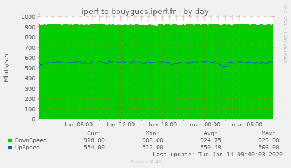

# munin-iperf
Utilisez ce script pour surveiller la bande passante avec iperf3 et Munin.
Consultez également **[FbxStat](https://github.com/mooondark/FreeboxStats)** pour découvrir d'autres plugins Munin.

Configurez une tâche crontab pour exécuter iperf_munin.sh toutes les 30 minutes (par exemple) :
7,37 * * * * /usr/bin/iperf_munin.sh > /dev/null 2>&1

Share & enjoy
